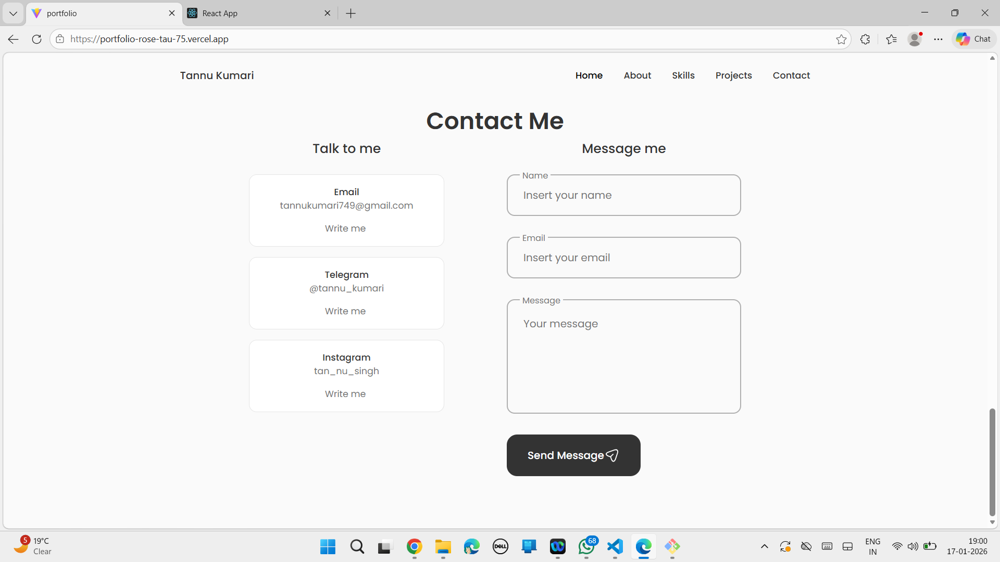
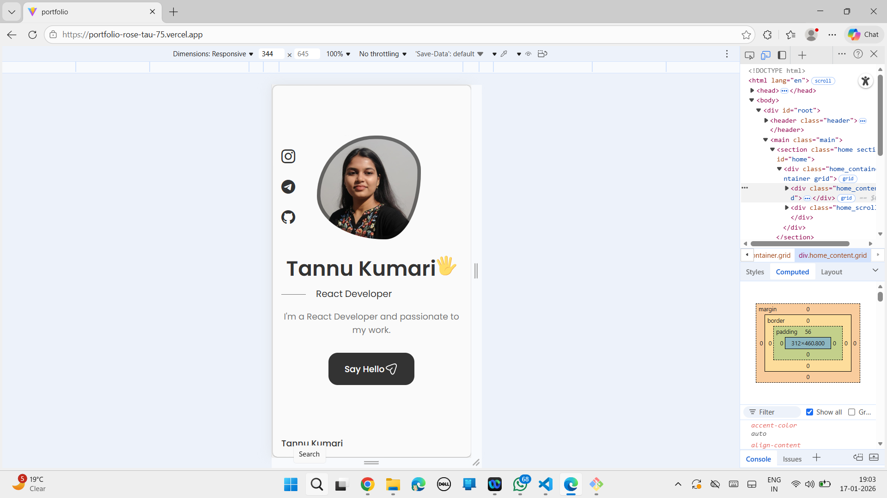

## Tannu Kumari – Full Stack Web Developer Portfolio

Welcome to my personal portfolio!  
This website showcases my skills, projects, and experience as a *Full Stack Web Developer*.

##  Live Website
- https://portfolio-rose-tau-75.vercel.app/

##  Tech Stack
This portfolio site is built using:
- HTML
- CSS
- JavaScript
- React.js

##  What You’ll Find Here
- About Me section  
- Skills & Technologies  
- Projects with live demos and GitHub links  
- Contact information  

This portfolio reflects my passion for clean design, responsive layouts, and real-world web development skills.

##  What I Learned
While building this portfolio, I strengthened my:
- Component-based UI design with React.js
- Responsive design principles for all screens
- Personal branding through web design
- Deployment using GitHub Pages

##  Screenshots

## Run Locally
- Clone the repository-
git clone https://github.com/Tannu-2001/Portfolio.git
- Run the development server- npm start
- View in browser: http://localhost:3000

## Future Improvements
Add dark / light mode
Add animation effects
Add downloadable resume section

##  Connect With Me
- LinkedIn: 
- GitHub: https://github.com/Tannu-2001
- Email: your.email@example.com
